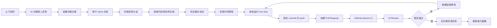

# 企业开发流程

本文档描述 Simu but Real 要模拟的企业开发流程。第一版以 Java 后端新人任务为主，流程尽量贴近真实公司，但会控制任务范围和风险。

## 总览



## 1. 入门测评

企业里新人加入团队后，mentor 通常会先判断能力边界，再分配低风险任务。平台中的入门测评用于判断：

- Java 基础。
- Spring Boot 基础。
- Git 使用能力。
- 测试意识。
- 是否能阅读需求、错误日志和 Review 反馈。

测评结果会影响任务难度，例如 `Java 入门 I`、`Java 入门 II`。

## 2. 分配新人任务

真实企业里的新人任务通常不是从零开发一个大系统，而是小范围、低风险、可验证的改动，例如：

- 修一个边界条件 bug。
- 补一组测试。
- 增加字段校验。
- 修复分页、排序、状态流转等常见逻辑。
- 补充异常处理。

平台分配任务时必须明确：

- 任务背景。
- 验收标准。
- 允许修改范围。
- 推荐分支名。
- mentor hint。
- 本地验证命令。
- CI 要求。

当前真实分配给用户的任务是：

```text
SBR-JAVA-373192: 补全任务状态校验逻辑
```

任务分支：

```text
task/validate-task-status
```

## 3. 创建训练仓库

企业开发不是在本地随意创建文件，而是在 Git 仓库中协作。平台会为任务准备训练仓库，包含：

- Java/Spring Boot 项目。
- 测试代码。
- GitHub Actions CI。
- Dev Container。
- README。
- 任务分支。

当前 MVP 已创建真实训练仓库：

```text
git@github.com:SingleButter/sbr-java-task-api-singlebutter.git
```

## 4. 本地开发

用户自行 clone 仓库到任意本地目录：

```bash
git clone git@github.com:SingleButter/sbr-java-task-api-singlebutter.git
cd sbr-java-task-api-singlebutter
git checkout task/validate-task-status
```

平台提供 Dev Container，但不强制使用。用户可以选择本地 Maven、IntelliJ IDEA、VS Code、Cursor 或其他 IDE。

## 5. 先写测试或补测试

企业流程中，测试用于明确需求边界。平台会鼓励用户先写一个失败测试，让 bug 或缺失规则暴露出来，再实现修复。

当前任务的测试方向包括：

- 已完成任务不能回退到 `TODO`。
- 已完成任务不能回退到 `IN_PROGRESS`。
- 非法状态流转应该返回清晰错误。

本地验证命令：

```bash
mvn test
```

## 6. 提交 commit

用户完成修改并通过本地测试后，提交 commit：

```bash
git add .
git commit -m "fix: validate completed task status transitions"
git push
```

训练目标包括：

- 小步提交。
- 清晰 commit message。
- 不提交无关文件。
- 理解 Git 工作区、暂存区和提交历史。

## 7. 创建 Pull Request

企业里通常不直接向 `main` 推代码，而是通过 PR 合并。PR 应包含：

- 改了什么。
- 为什么改。
- 如何验证。
- 关联任务。

示例 PR 模板：

```md
## Summary
修复已完成任务可回退状态的问题。

## Verification
- mvn test

## Checklist
- [ ] 已补充测试
- [ ] CI 通过
- [ ] 未修改任务范围外文件
```

## 8. CI 检查

GitHub Actions 会运行：

```bash
mvn test
```

CI 失败时，用户需要阅读失败 job、失败命令和错误日志，然后本地复现并修复。

## 9. AI Review

Review Agent 的目标是模拟企业 reviewer。它应该检查：

- 是否符合任务验收标准。
- 是否只修改允许范围。
- 是否补充了足够测试。
- 是否引入行为回归。
- 命名和代码结构是否清晰。
- 是否有过度实现。
- 是否遗漏边界条件。

Review 不通过时，用户继续修改、push，PR 自动更新，CI 和 Review 重新运行。

## 10. 合并和能力更新

当 CI 和 Review 都通过，任务才算完成。平台更新：

- 已完成任务数。
- CI 修复次数。
- Review 修改次数。
- PR 通过率。
- 用户能力等级。
- 下一任务难度。

## 分支落后和冲突处理

真实企业中，别人的 PR 先合并后，用户自己的分支可能落后于 `main`，甚至必须修改代码才能继续合并。

典型同步方式：

```bash
git fetch origin
git checkout task/validate-task-status
git rebase origin/main
mvn test
```

如果发生冲突，用户需要手动解决后继续：

```bash
git add .
git rebase --continue
git push --force-with-lease
```

第一版 MVP 暂时采用每个用户一个独立训练仓库、一次一个任务的方式，降低冲突复杂度。后续阶段可以专门加入多人协作和冲突解决训练。
